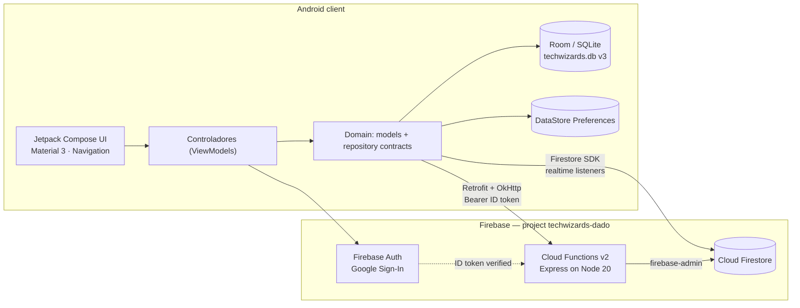
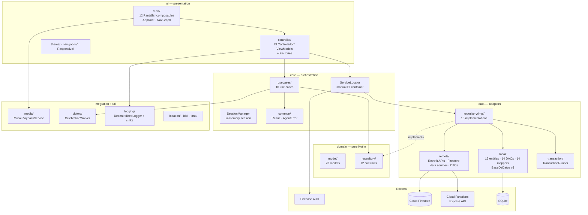
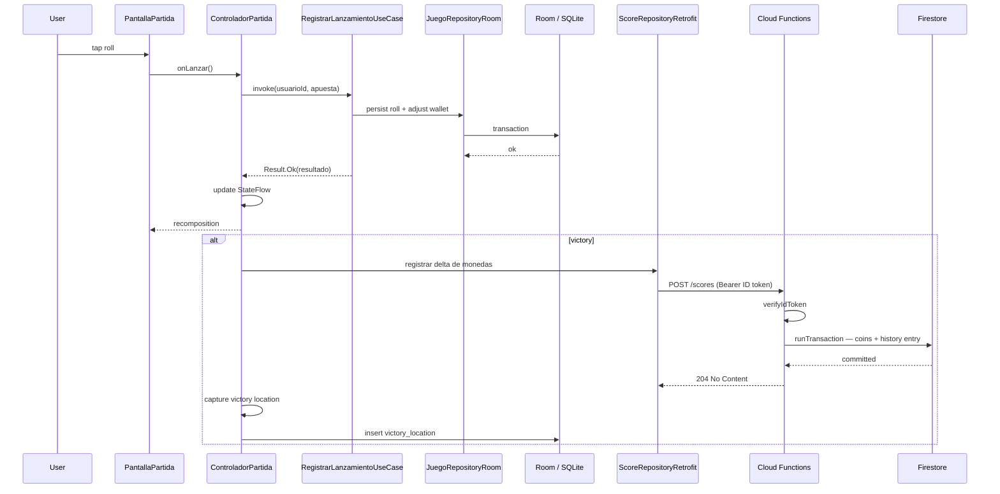
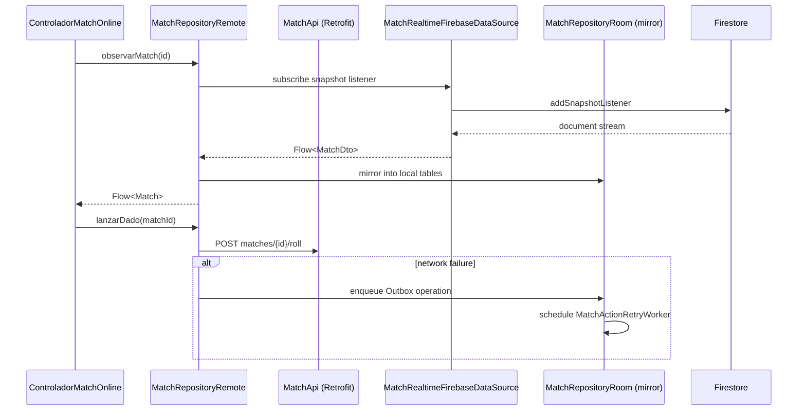
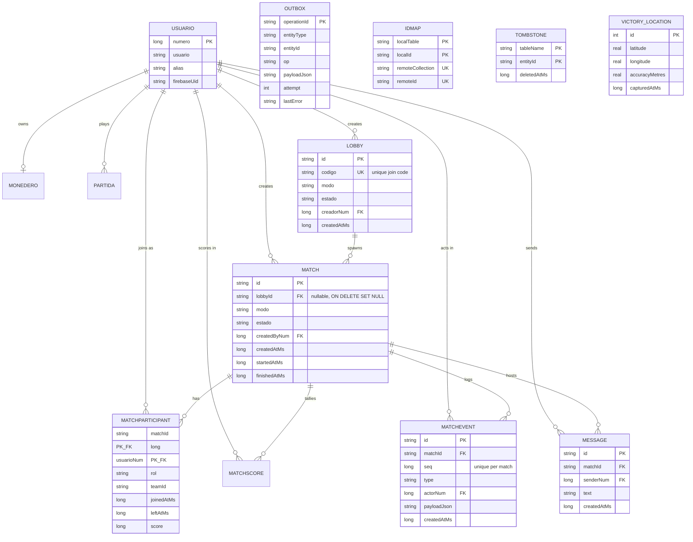
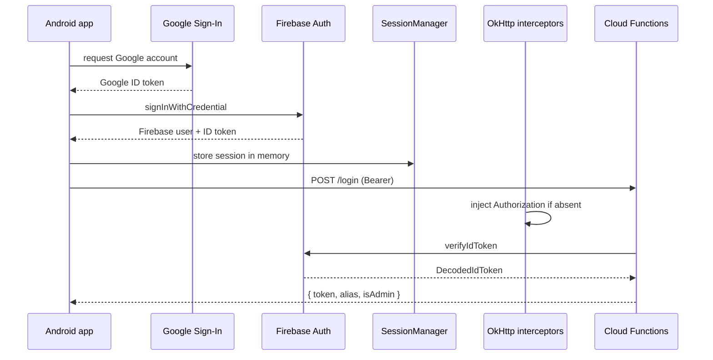
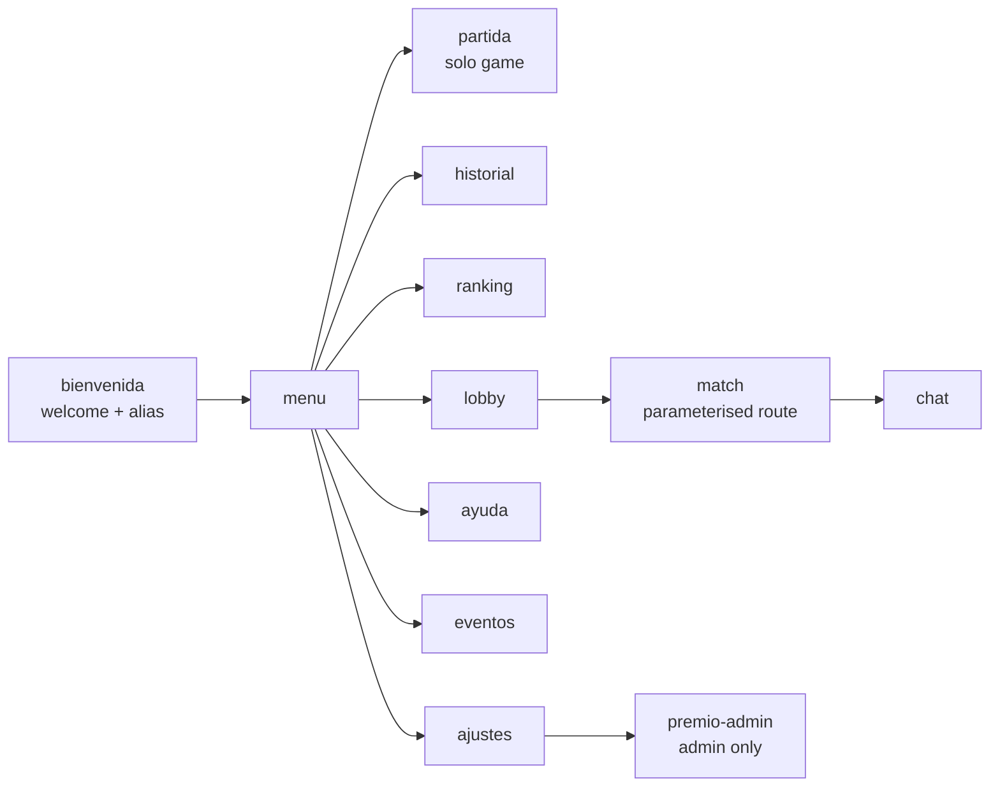
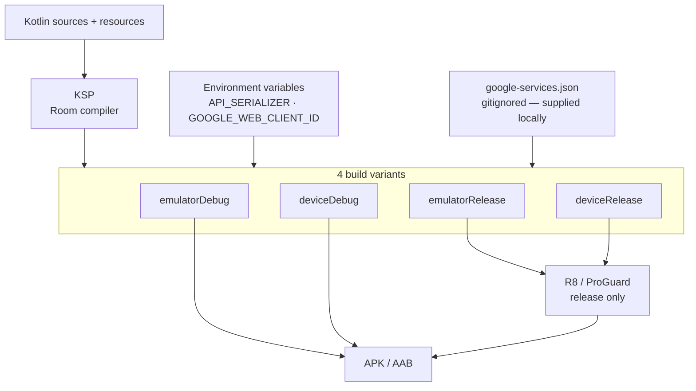

# TechWizards — Architecture Specification

> **Scope of this document.** Every technical claim below is derived from artefacts present in the repository: `libs.versions.toml`, `build.gradle.kts`, `AndroidManifest.xml`, the Room database and migrations, exported schemas, the Cloud Functions TypeScript source, `firestore.rules`, `.firebaserc` and the Kotlin source tree. Where the repository does **not** contain something — a CI pipeline, a `firebase.json`, a working sync engine — this document states it explicitly rather than describing an intended state.

- **Repository:** `https://github.com/dadd86/TechWizards` (branch `master`)
- **Application ID:** `com.diegodiaz.techwizards`
- **Firebase project:** `techwizards-dado`
- **Version:** `versionName 1.0` / `versionCode 1`
- **Spanish edition of this document:** [`docs/es/ARCHITECTURE.md`](docs/es/ARCHITECTURE.md)

---

## Table of Contents

1. [Executive Summary and Global Stack](#1-executive-summary-and-global-stack)
2. [System Topology](#2-system-topology)
3. [Design Patterns and Principles](#3-design-patterns-and-principles)
4. [Persistence Model](#4-persistence-model)
5. [API and Interface Specification](#5-api-and-interface-specification)
6. [Frontend / UI Architecture](#6-frontend--ui-architecture)
7. [Deployment Pipeline and Infrastructure](#7-deployment-pipeline-and-infrastructure)
8. [Testing](#8-testing)
9. [Known Limitations and Architectural Risks](#9-known-limitations-and-architectural-risks)

---

## 1. Executive Summary and Global Stack

TechWizards is a **native Android multiplayer dice game** built with Jetpack Compose and Kotlin, backed by a Firebase serverless platform. The application is offline-capable: gameplay, wallet and match state are persisted locally in Room and mirrored to a remote Express API running on Cloud Functions, with Firestore providing realtime lobby and match streams.

### Functional scope, derived from the navigation graph and use cases

| Area | Capabilities |
| --- | --- |
| **Gameplay** | Dice rolls resolved through `ResolverTiradaUseCase`, wallet (`Monedero`) balance adjustment, victory detection |
| **Multiplayer** | Lobbies with join codes, matches with participants, per-match scores, event log with monotonic sequence, in-match chat |
| **Progression** | Local match history, remote history mirrored to Firestore, top-10 leaderboard |
| **Common prize pot** | Shared prize (`prize/common`) that accumulates via increments and is claimed atomically with idempotency |
| **Geolocation** | Victory coordinates captured and persisted locally (`victory_location`) |
| **Media** | Foreground service for background music playback |
| **Personalisation** | Three UI languages (ES / EN / DE), light/dark theme, Material 3 dynamic colour |
| **Observability** | In-app decentralised logger with pluggable sinks and PII masking |

### Ecosystem at a glance



### Global technology table

| Layer | Technology | Version |
| --- | --- | --- |
| Language | Kotlin | `2.0.21` |
| Build | Android Gradle Plugin | `8.13.2` |
| Build | KSP | `2.0.21-1.0.25` |
| Target | `compileSdk` / `targetSdk` / `minSdk` | `36` / `36` / `24` |
| JVM | Java source, target and `jvmTarget` | `17` |
| UI | Jetpack Compose BOM | `2024.10.01` |
| UI | Material 3, Foundation, UI Tooling | via BOM |
| UI | Activity Compose | `1.11.0` |
| UI | Navigation Compose | `2.9.5` |
| UI | Core SplashScreen | `1.0.1` |
| Lifecycle | `lifecycle-runtime-ktx` | `2.9.4` |
| Async | Kotlin Coroutines | `1.10.2` |
| Async | RxJava3 / RxAndroid / coroutines-rx3 | `3.1.8` / `3.0.2` / `1.8.1` |
| Persistence | Room runtime, ktx, compiler, rxjava3 | `2.6.1` |
| Persistence | DataStore Preferences | `1.1.1` |
| Background | WorkManager | `2.9.1` |
| Security | `androidx.security:security-crypto` | `1.1.0` |
| Networking | Retrofit | `2.11.0` |
| Networking | OkHttp logging interceptor / MockWebServer | `4.12.0` |
| Serialisation | Moshi Kotlin | `1.15.1` |
| Serialisation | Gson | `2.11.0` |
| Serialisation | kotlinx-serialization-json | `1.7.3` |
| Google | Play Services Location | `21.3.0` |
| Google | Play Services Auth | `21.2.0` |
| Firebase | Firebase BOM (Auth KTX, Firestore KTX) | `33.5.1` |
| Firebase | Google Services plugin | `4.4.2` |
| Backend | Node.js | `20` |
| Backend | TypeScript | `^5.7.3` |
| Backend | Express | `^4.19.2` |
| Backend | firebase-functions / firebase-admin | `^7.0.0` / `^13.6.0` |
| Backend | CORS | `^2.8.5` |
| Testing | JUnit 4 / MockK / coroutines-test | `4.13.2` / `1.13.12` / `1.10.2` |
| Testing | AndroidX JUnit / Espresso / Compose UI Test | `1.3.0` / `3.7.0` / via BOM |

### Repository layout

```text
TechWizards/
├── app/                            # Android application module
│   ├── src/main/java/com/diegodiaz/techwizards/
│   │   ├── app/                    # Application class, MainActivity, locale startup gate
│   │   ├── core/                   # ServiceLocator, SessionManager, Result, use cases
│   │   ├── credenciales/           # Credential store abstraction
│   │   ├── data/                   # local (Room), remote (Retrofit/Firestore), repositories
│   │   ├── domain/                 # Models and repository contracts
│   │   ├── integration/            # Media playback, victory celebration
│   │   ├── ui/                     # Compose views, controllers, navigation, theme
│   │   └── util/                   # Logging, location, ids, time, sync
│   ├── src/test/                   # JVM unit tests
│   ├── src/androidTest/            # Instrumented tests
│   ├── schemas/                    # Exported Room schemas (1.json, 2.json, 3.json)
│   └── build.gradle.kts
├── functions/                      # Cloud Functions backend
│   ├── src/index.ts                # Express API — 9 routes
│   ├── src/requiereAuth.ts         # (empty)
│   └── types/                      # Ambient type declarations
├── SQL/PrimerSQL.sql               # Reference SQL schema and pragmas
├── gradle/libs.versions.toml       # Version catalog
├── firestore.rules
├── .firebaserc
└── AGENTS.md                       # Project working agreements
```

---

## 2. System Topology

### 2.1 Architectural style

The Android module is a **single-module Clean Architecture monolith** with strict package-level layering and **manual dependency injection through a Service Locator**. No DI framework (Hilt, Koin, Dagger) is present.

The backend is a **serverless HTTP monolith**: one Express application exported as a single Cloud Functions v2 entry point (`export const api = onRequest({ cors: true }, app)`), configured with `setGlobalOptions({ maxInstances: 10 })`.

### 2.2 Layer diagram



### 2.3 Layer responsibilities

| Package | Responsibility | Depends on |
| --- | --- | --- |
| `domain.model` | Pure Kotlin data classes and enums | Nothing |
| `domain.repository` | 12 repository contracts | `domain.model` |
| `core.common` | `Result<T, E>` sealed type, `AgentError` taxonomy | Nothing |
| `core.usecases` | 16 use cases, one responsibility each | `domain` |
| `core.ServiceLocator` | Lazy singleton graph — DB, DAOs, APIs, repositories, use cases | Everything |
| `data.local` | Room entities, DAOs, mappers, converters, migrations | `domain` |
| `data.remote` | Retrofit interfaces, DTOs, Firestore data sources, mappers | `domain` |
| `data.repository.impl` | 13 concrete repositories implementing domain contracts | `data.local`, `data.remote` |
| `ui.controller` | 13 ViewModels exposing immutable state | `core`, `domain` |
| `ui.view` | 12 screen composables plus `AppRoot` and `NavGraph` | `ui.controller` |
| `integration` | Media playback service, victory celebration worker | `core`, `domain` |
| `util` | Logging, location tracking, UUID provider, date formats | Nothing app-specific |

The domain layer holds no Android or framework imports. Repository implementations depend on the contracts, not the other way round, so the dependency rule is respected — although, unlike a multi-module setup, it is enforced by convention rather than by the build. See §9.7.

### 2.4 Data flow — a dice roll



### 2.5 Data flow — realtime match



`MatchRepositoryRemote` is constructed in `ServiceLocator` with a `mirrorRoom` parameter holding a full `MatchRepositoryRoom`. Remote is authoritative; local is a mirror that keeps the UI responsive and survives connectivity loss.

---

## 3. Design Patterns and Principles

### 3.1 Patterns identified in the codebase

| Pattern | Category | Evidence |
| --- | --- | --- |
| **Service Locator** | Creational | `object ServiceLocator` with `by lazy` graph for DB, DAOs, APIs, repositories and use cases |
| **Singleton** | Creational | `BaseDeDatos.get()` uses double-checked locking with `@Volatile inst` |
| **Factory Method** | Creational | `ControladorAuthFactory`, `ControladorAjustesFactory`, `ControladorPartidaFactory`, `SimpleVmFactory` implementing `ViewModelProvider.Factory` |
| **Builder** | Creational | `Room.databaseBuilder(...)`, `OkHttpClient.Builder()`, `Retrofit.Builder()`, `Moshi.Builder()` |
| **Repository** | Structural | 12 domain contracts, 13 implementations under `data/repository/impl/` |
| **Adapter** | Structural | 14 local mappers plus `ScoreRemoteMapper` and `MatchRemoteMapper` translating entity ⇄ domain ⇄ DTO |
| **Proxy / mirror** | Structural | `MatchRepositoryRemote` wrapping `MatchRepositoryRoom` as `mirrorRoom` |
| **Facade** | Structural | `ServiceLocator` exposes a simplified surface over the whole object graph |
| **Chain of Responsibility** | Behavioural | OkHttp interceptor chain: `FirebaseAuthInterceptor` → `SessionAuthInterceptor` → `HttpLoggingInterceptor` |
| **Observer** | Behavioural | `StateFlow` in controllers, Room `Flow` queries, Firestore snapshot listeners |
| **Command / Outbox** | Behavioural | `OutboxEntity` records `entityType`, `op`, `payloadJson`, `attempt`, `lastError` for deferred replay |
| **Strategy** | Behavioural | `LogSink` interface with `AndroidLogSink` and `FileLogSink` implementations, registered at runtime |
| **Template Method** | Behavioural | `RoomCallbackPragmas : RoomDatabase.Callback` overriding lifecycle hooks |
| **Result object** | Behavioural | `sealed class Result<out T, out E>` with `Ok` / `Err`, avoiding exception-driven control flow |
| **Unit of Work** | Behavioural | `TransactionRunner` / `RoomTransactionRunner` abstraction over `withTransaction` |
| **Soft delete / Tombstone** | Data | `TombstoneEntity(tableName, entityId, deletedAtMs)` |
| **Identity map** | Data | `IdMapEntity` mapping `(localTable, localId)` ⇄ `(remoteCollection, remoteId)` |
| **Idempotency key** | Integration | `claimId` on `POST /prize/common/claim`, compared against `lastClaimId` inside the Firestore transaction |

### 3.2 SOLID adherence, with evidence

**Single Responsibility.** The `core/usecases` package contains 16 classes, each exposing one operation: `CerrarSesionUseCase`, `RegistrarLanzamientoUseCase`, `ResolverTiradaUseCase`, `ActualizarPremioComunUseCase`, and so on. Persistence, mapping and validation are likewise split — 14 entities, 14 DAOs and 14 dedicated mappers rather than one god-object.

**Open/Closed.** The logging subsystem is the clearest case. `DecentralizedLogger.registerSink(...)` accepts any `LogSink`; adding a Crashlytics or network sink requires no change to the logger:

```kotlin
DecentralizedLogger.registerSink(AndroidLogSink())
DecentralizedLogger.registerSink(FileLogSink(this))
DecentralizedLogger.setMinLevel(LogLevel.INFO)
DecentralizedLogger.addPiiMask(Regex("[0-9a-fA-F-]{6,}"))
```

**Liskov Substitution.** Repository contracts return domain models and `Result` types, never Room entities or Retrofit `Response` objects, so `MatchRepositoryRoom` and `MatchRepositoryRemote` are interchangeable behind `MatchRepository`.

**Interface Segregation.** Remote access is split into narrow API interfaces rather than one client: `ScoreApi`, `ScoresApi`, `MatchApi`, `PrizeApi`, `FirestorePlayersApi`. Each declares only the endpoints its consumer needs.

**Dependency Inversion.** Use cases and controllers depend on `domain.repository` interfaces; concrete adapters are bound in `ServiceLocator`. `RetrofitProvider` further inverts the auth dependency by taking `tokenProvider: () -> String?` instead of importing Firebase, and documents that choice in its KDoc.

### 3.3 Security-conscious conventions

Source files carry KDoc blocks with an explicit `@security` tag stating the threat considered. Examples found verbatim in the code:

- `Result` — avoids exposing unsanitised exceptions to upper layers.
- `App` — registers identifier masking before attaching persistent sinks.
- `SessionAuthInterceptor` — does not expose the token in logs and operates in memory only.
- `BaseDeDatos` — exports the schema for auditing and applies pragmas; runs incremental migrations to avoid data loss.

`createLoggingInterceptor()` calls `redactHeader("Authorization")`, so bearer tokens never reach Logcat even at `Level.BODY`. On the backend, `maskToken()` logs only the token length and a six-character head/tail preview.

---

## 4. Persistence Model

### 4.1 Strategy

Persistence is split across three stores, each chosen for a different access pattern:

| Store | Technology | Contents |
| --- | --- | --- |
| Structured local data | Room 2.6.1 over SQLite, database `techwizards.db`, version `3` | 15 entities: users, wallet, games, lobbies, matches, chat, sync bookkeeping, victory locations |
| Key-value preferences | DataStore Preferences 1.1.1 | `GameSettings`, selected language tag, match snapshot cache |
| Remote / shared | Cloud Firestore | `players/{uid}`, `players/{uid}/history/{id}`, `users/{uid}`, `prize/common` |

Room is configured with `exportSchema = true` and `room.schemaLocation` pointing at `app/schemas`, so versions 1, 2 and 3 are committed as JSON and diffable in code review. KSP is configured with `room.incremental` and `room.expandProjection` enabled.

### 4.2 Integrity guarantees

`RoomCallbackPragmas` applies SQLite pragmas that enforce foreign keys and enable WAL journalling. Every child table declares explicit foreign keys with cascade semantics — for example `MatchEvent.matchId` and `MatchParticipant.matchId` both `ON DELETE CASCADE`, while `Match.lobbyId` uses `ON DELETE SET NULL` so a match survives the deletion of the lobby that spawned it.

### 4.3 Entity relationship diagram



### 4.4 Migrations

Both migrations are hand-written; neither uses destructive fallback, so no user data is discarded on upgrade.

| Migration | Effect |
| --- | --- |
| `MIGRATION_1_2` | Adds `Partida.nombreJugador` and backfills it from `Usuario.usuario` via correlated `UPDATE`; creates `evento`, `Lobby`, `Match`, `MatchEvent`, `MatchParticipant`, `MatchScore`, `Message`, `Outbox`, `IdMap`, `Tombstone`; creates 13 indexes including the unique `index_Lobby_codigo` and `index_MatchEvent_matchId_seq` |
| `MIGRATION_2_3` | Drops the legacy `VictoryLocation` table and creates `victory_location` with an autoincrement primary key |

The backfill in `MIGRATION_1_2` is the notable detail: rather than defaulting the new column to an empty string and losing context, it recovers the player name from the related `Usuario` row.

`MIGRATION_2_3` is a drop-and-recreate, which is safe here only because the table was newly introduced and carried no production data. See §9.9.

### 4.5 Sync bookkeeping trio

Three tables exist purely to support eventual-consistency synchronisation:

- **`Outbox`** — durable queue of pending remote operations, with attempt counter and last error, enabling at-least-once delivery with backoff.
- **`IdMap`** — bidirectional identity mapping so locally generated IDs can be reconciled with server-assigned IDs. The unique index on `(remoteCollection, remoteId)` prevents two local rows claiming the same remote entity.
- **`Tombstone`** — deletion markers so a delete performed offline is not resurrected by a later pull.

This is a textbook offline-first design. The tables and DAOs exist and are wired into `ServiceLocator`; the general-purpose sync engine that consumes them is not implemented. See §9.3.

### 4.6 Firestore data model

| Path | Written by | Contents |
| --- | --- | --- |
| `users/{uid}` | `POST /login` | `alias`, `updatedAt` |
| `players/{uid}` | `POST /login`, `POST /scores`, prize claim | `uid`, `alias`, `coins`, `wins`, `losses`, `updatedAt` |
| `players/{uid}/history/{autoId}` | `POST /scores` | `uid`, `alias`, `deltaMonedas`, `coinsAfter`, `createdAt` server timestamp |
| `prize/common` | prize endpoints | `descripcion`, `valor`, `lastClaimId`, `lastClaimAmount`, `lastClaimedByUid`, `lastClaimedAt`, `updatedAt`, `updatedByUid` |

### 4.7 Transactional behaviour

Both mutating balance operations run inside `db.runTransaction`, guaranteeing read-modify-write atomicity under concurrent access:

- **`POST /scores`** reads current `coins`, applies `Math.max(0, current + delta)` to prevent negative balances, writes the player document and appends a history entry — all in one transaction.
- **`POST /prize/common/claim`** reads the pot, checks `lastClaimId === claimId` for idempotency, resets `valor` to `0`, records the claim metadata, and credits the player. A repeated request with the same `claimId` returns `alreadyClaimed: true` without paying twice.

The claim handler also defensively repairs a corrupt `coins` field: if the stored value is not a finite number it is treated as `0` rather than producing `NaN`.

---

## 5. API and Interface Specification

### 5.1 Backend surface — Cloud Functions

A single Express app exported as `api`, with `cors({ origin: true })` and `express.json()` applied globally.

| Method | Path | Auth | Behaviour |
| --- | --- | --- | --- |
| `GET` | `/leaderboard/top10` | Public | Top 10 players by `coins`, with position and alias fallback chain |
| `GET` | `/scores/top10` | Public | Same data in the OpenAPI-compatible shape `{ items: [...] }` with ISO timestamps |
| `POST` | `/login` | Bearer | Upserts `users/{uid}` and `players/{uid}`; returns `{ token, alias, isAdmin }` |
| `POST` | `/scores` | Bearer | Transactional coin delta plus history entry; returns `204` |
| `GET` | `/prize/common` | Public | Current shared prize, with defaults if the document is absent |
| `PUT` | `/prize/common` | Bearer + admin | Sets description and value |
| `POST` | `/prize/common/increment` | Bearer | Transactionally adds `delta` to the pot |
| `POST` | `/prize/common/claim` | Bearer | Idempotent claim; resets pot and credits the caller |

### 5.2 Authentication and authorisation

**Client side.** Google Sign-In via Play Services Auth produces a Firebase credential; `AuthRepositoryFirebase` exchanges it for a Firebase session. The ID token is held by `SessionManager` and `CredentialsStore`, and injected by OkHttp interceptors.

**Interceptor precedence.** Both auth interceptors check `request.header("Authorization") != null` first and pass through untouched if a header is already present, so an explicit `@Header` annotation on a Retrofit method always wins over ambient injection. This avoids the classic double-header bug.

**Server side.** `requireAuth` extracts the bearer token with `/^Bearer (.+)$/` and calls `admin.auth().verifyIdToken(...)`. Failures return `401` with a machine-readable code (`missing_bearer_token`, `invalid_token`) and never leak the underlying exception to the client.

**Admin check.** `requireAdmin` accepts three claim shapes — `admin === true`, `role === "admin"`, or `claims.admin === true` — and returns `403 admin_only` otherwise.



### 5.3 Input validation

Every mutating endpoint validates before touching Firestore, with explicit ceilings defined as constants (`MAX_SCORE = 100_000`, `MAX_PRIZE_VALUE = 100_000`):

| Check | Endpoint | Rejection |
| --- | --- | --- |
| Non-empty trimmed alias | `/login`, `/scores` | `400 invalid_alias` |
| `Number.isInteger(deltaMonedas)` within `±MAX_SCORE` | `/scores` | `400 invalid_delta` |
| Positive integer `delta` within `MAX_PRIZE_VALUE` | `/prize/common/increment` | `400 invalid_delta` |
| Integer `valor` in `[0, MAX_PRIZE_VALUE]` | `PUT /prize/common` | `400 invalid_valor` |
| Non-empty `claimId` | `/prize/common/claim` | `400 invalid_claimId` |
| Present `uid` on the decoded token | all authed routes | `401 missing_uid` |

`Number.isInteger` rather than `typeof === "number"` is the correct choice here: it rejects `NaN`, `Infinity` and fractional values in one predicate.

### 5.4 Client API interfaces

| Interface | Endpoints |
| --- | --- |
| `ScoreApi` | `GET scores/top10`, `GET leaderboard/top10`, `POST scores`, `GET prize/common`, `PUT prize/common`, `POST login`, `POST prize/common/increment`, `POST prize/common/claim` |
| `ScoresApi` | `GET scores/top`, `POST scores` |
| `PrizeApi` | `GET prize/common`, `PUT prize/common` |
| `MatchApi` | `GET matches/{id}`, `GET matches/{id}/participants`, `GET matches/{id}/scores`, `POST matches`, `POST matches/{id}/ready`, `POST matches/{id}/roll` |
| `FirestorePlayersApi` | `GET players/{userId}` against the Firestore REST endpoint |

`MatchApi` declares six endpoints that have **no counterpart in `functions/src/index.ts`**. Match orchestration is therefore served by Firestore realtime listeners, not by that REST surface. See §9.4.

### 5.5 Firestore security rules

```javascript
rules_version='2'
service cloud.firestore {
  match /databases/{database}/documents {
    match /players/{userId}/history/{historyId} {
      allow read, write: if request.auth != null && request.auth.uid == userId;
    }
    match /{document=**} {
      allow read, write: if request.time < timestamp.date(2026, 1, 16);
    }
  }
}
```

The first rule is correct and specific: a player may only read and write their own history subcollection. The second is the Firebase console's default time-boxed catch-all, and its expiry date has passed. See §9.1 — this is a live functional defect, not merely a hardening gap.

### 5.6 Error handling contract

Errors are returned as `{ "error": "<machine_readable_code>" }` with an appropriate status. Observed codes: `missing_bearer_token`, `invalid_token`, `missing_uid`, `invalid_alias`, `invalid_delta`, `invalid_valor`, `invalid_descripcion`, `invalid_claimId`, `admin_only`, `internal`.

On the client, `core.common.AgentError` provides a matching taxonomy — network, validation, database, timeout, unknown — and `Result<T, E>` carries it upward without leaking exceptions.

One inconsistency: `/scores` and `/login` return the opaque `internal` on failure, while `/prize/common/increment` and `/prize/common/claim` return `e?.message` and, in the claim handler, the full `e?.stack`. See §9.2.

---

## 6. Frontend / UI Architecture

### 6.1 Rendering paradigm

**Declarative, single-Activity Jetpack Compose.** `MainActivity` is the only Activity declared in the manifest. It enables edge-to-edge, holds theme state in `rememberSaveable`, and delegates to `AppRoot` inside `TechWizardsTheme`. Navigation is handled by Navigation Compose within one `NavHost`.

### 6.2 Screen graph

Twelve routes registered in `NavGraph`, with `bienvenida` as the start destination:



The twelfth entry is a parameterised `composable(...)` with `navArgument` typing, used for the match screen.

### 6.3 State management

State is unidirectional and screen-scoped. There is no global state container, no Redux-style store and no `SharedViewModel` singleton.

| Mechanism | Purpose |
| --- | --- |
| `StateFlow` in `Controlador*` classes | UI state, collected with `collectAsState()` |
| Immutable state classes (`AuthState`, `AjustesState`) | Typed screen contracts |
| `ViewModelProvider.Factory` implementations | Constructor injection into ViewModels without a DI framework |
| `remember` / `rememberSaveable` | Local composition state and configuration-change survival |
| Room `Flow` queries | Reactive local reads |
| DataStore | Persisted preferences |
| `SessionManager` | In-memory authenticated session shared across the object graph |

`ControladorPartida` is deliberately instantiated once in `NavGraph` via `ControladorPartidaFactory` and shared across the game-related destinations, so an in-progress game survives navigation.

### 6.4 Theming

Material 3 with **dynamic colour enabled by default** (`dynamicColor: Boolean = true`), falling back to explicit `darkColorScheme` / `lightColorScheme` palettes on API levels below 31. Dark mode follows `isSystemInDarkTheme()` by default and can be overridden by the user, with `values-night` resources supplying the corresponding non-Compose assets.

### 6.5 Internationalisation

Per-app language selection is implemented with the AndroidX API rather than a home-grown locale hack:

- `android:localeConfig="@xml/locale_config"` declares `en-US`, `de-DE`, `es-ES`.
- `App.aplicarIdiomaPreferido()` reads the persisted tag from DataStore on `Dispatchers.IO`, sanitises it through `LocaleListCompat.forLanguageTags`, and applies it with `AppCompatDelegate.setApplicationLocales` on the main dispatcher.
- `LocaleStartupState.markReady()` gates first paint so the UI is never drawn in the wrong language and then flipped.
- Resource sets: `values` (default), `values-de`, `values-en`, `values-night`.

`sanitizeLanguageTag` falls back to the default when a stored tag is blank or unresolvable, so a corrupted preference cannot brick the locale.

### 6.6 Responsiveness and startup

`ui/Responsive/Responsive.kt` exposes a `UiDims` object threaded through `NavGraph` and into screens, centralising breakpoint-dependent sizing. Startup uses `androidx.core:core-splashscreen` with a dedicated `Theme.TechWizards.Splash`.

### 6.7 Background and media

| Component | Type | Purpose |
| --- | --- | --- |
| `MusicPlaybackService` | Foreground service, `foregroundServiceType="mediaPlayback"`, `exported=false` | Background music |
| `MusicPlaybackController` | Controller | Playback commands from the UI |
| `VictoryCelebrationWorker` | `WorkManager` worker | Deferred victory celebration |
| `MatchActionRetryWorker` | `WorkManager` worker | Retries failed match actions from the outbox |

### 6.8 Declared permissions

`INTERNET`, `ACCESS_NETWORK_STATE`, `READ_MEDIA_AUDIO`, `POST_NOTIFICATIONS`, `FOREGROUND_SERVICE`, `FOREGROUND_SERVICE_MEDIA_PLAYBACK`, `ACCESS_FINE_LOCATION`, `ACCESS_COARSE_LOCATION`, `WRITE_CALENDAR`, `READ_CALENDAR`, `READ_EXTERNAL_STORAGE` (capped at `maxSdkVersion="32"`).

The storage permission is correctly version-capped. The two calendar permissions are declared but no calendar code exists in the source tree. See §9.8.

---

## 7. Deployment Pipeline and Infrastructure

### 7.1 Build configuration

**Product flavours.** One dimension, `target`, with two flavours that differ only in `API_BASE_URL`:

| Flavour | `API_BASE_URL` |
| --- | --- |
| `emulator` | `http://10.0.2.2:5002/techwizards-dado/us-central1/api/` |
| `device` | `http://192.168.178.23:5002/techwizards-dado/us-central1/api/` |

`10.0.2.2` is the Android emulator's alias for the host loopback; both point at the Firebase Functions emulator on port 5002.

**Build types.** `debug` with `isMinifyEnabled = false`; `release` with `isMinifyEnabled = true` and `proguard-android-optimize.txt` plus project rules.

**Environment-driven build config.** Two fields are read from the environment at configuration time with safe defaults:

```kotlin
val apiSerializer = providers.environmentVariable("API_SERIALIZER")
    .orElse("moshi").get()
buildConfigField("String", "API_SERIALIZER", "\"$apiSerializer\"")

val googleWebClientId = providers.environmentVariable("GOOGLE_WEB_CLIENT_ID")
    .orElse("CHANGE_ME").get()
buildConfigField("String", "GOOGLE_WEB_CLIENT_ID", "\"$googleWebClientId\"")
```

Using `CHANGE_ME` as the OAuth client fallback is the right instinct: the build succeeds but sign-in fails loudly rather than silently using a committed credential.

### 7.2 Build variant matrix



### 7.3 Backend deployment

`functions/package.json` defines three scripts:

```json
"build":  "tsc",
"serve":  "npm run build && firebase emulators:start --only functions,firestore",
"deploy": "firebase deploy --only functions"
```

Runtime is pinned to Node 20. Concurrency is capped with `setGlobalOptions({ maxInstances: 10 })`, bounding both cold-start fan-out and cost.

`.firebaserc` binds the default project to `techwizards-dado`. There is **no `firebase.json` in the repository**, so both `serve` and `deploy` will fail on a fresh clone. See §9.5.

### 7.4 Network security configuration

`android:usesCleartextTraffic="true"` is set application-wide, and `network_security_config.xml` permits cleartext for exactly three hosts:

```xml
<domain-config cleartextTrafficPermitted="true">
    <domain includeSubdomains="false">10.0.2.2</domain>
    <domain includeSubdomains="false">127.0.0.1</domain>
    <domain includeSubdomains="false">192.168.178.23</domain>
</domain-config>
```

The per-domain allowlist is the correct mechanism. The application-level `usesCleartextTraffic="true"` however overrides the restriction and permits cleartext everywhere. See §9.6.

### 7.5 Secrets management

| Secret | Handling |
| --- | --- |
| `google-services.json` | Gitignored under four patterns; never committed |
| `GOOGLE_WEB_CLIENT_ID` | Environment variable with a `CHANGE_ME` fallback |
| Firebase ID token | In-memory only, via `SessionManager` and `CredentialsStore` |
| `local.properties` | Gitignored |

`.gitignore` also applies a blanket `*.json` exclusion with targeted re-inclusions (`!functions/tsconfig.json`, `!functions/package.json`), which is a defensive stance against accidentally committing credential files.

### 7.6 Continuous integration and delivery

**No CI/CD pipeline exists in this repository.** There is no `.github/workflows/` directory and no GitLab CI configuration. Building, testing, linting and deployment are all manual.

---

## 8. Testing

| Source set | File | Tests |
| --- | --- | --- |
| `test` | `ControladorAuthTest.kt` | 3 |
| `test` | `RegistrarUbicacionVictoriaUseCaseTest.kt` | 2 |
| `test` | `scoresRepositoryRemoteTest.kt` | 2 |
| `test` | `decentralizedLoggerTest.kt` | 2 |
| `test` | `AuthRepositoryFirebaseTest.kt` | 1 |
| `test` | `ExampleUnitTest.kt` | 1 (Android template default) |
| `test` | `VictoryLocationLocalMapperTest.kt` | 0 |
| `androidTest` | `ExampleInstrumentedTest.kt` | 1 (Android template default) |

**Total: 12 `@Test` methods**, of which 2 are unmodified Android Studio template tests and 1 class declares no tests at all. The effective count of purposeful tests is **9**.

Testing infrastructure is nevertheless well provisioned: MockK `1.13.12`, `kotlinx-coroutines-test`, OkHttp MockWebServer for API-level tests, Espresso and Compose UI Test with `ui-test-manifest` on the debug variant. `ScoresRepositoryRemoteTest` uses MockWebServer to exercise the Retrofit layer against a real HTTP stub, which is the right technique.

For a codebase of 203 production Kotlin files with 16 use cases and 13 repositories, 9 meaningful tests is thin. The architecture is highly testable — every dependency is an interface bound in `ServiceLocator` — so the gap is one of investment rather than design. See §9.10.

---

## 9. Known Limitations and Architectural Risks

Findings are stated plainly, ordered by severity. A specification that omits them would not describe the system accurately.

### 9.1 Firestore catch-all rule has expired — active functional defect

```javascript
match /{document=**} {
  allow read, write: if request.time < timestamp.date(2026, 1, 16);
}
```

This is the Firebase console's default time-boxed rule and its expiry has passed. Every client path other than `players/{userId}/history/{historyId}` is now **denied** for direct SDK access. Realtime lobby and match listeners that read `players/{uid}` or match documents directly will fail with permission errors.

Server-side routes are unaffected, because `firebase-admin` bypasses security rules — which is precisely why the failure is asymmetric and easy to misdiagnose: the leaderboard endpoint still works while the realtime listeners do not.

**Remediation:** replace the catch-all with explicit per-collection rules. At minimum: `players/{uid}` readable by any authenticated user and writable only through the backend; `prize/common` readable by authenticated users, writable only by admin claims; `users/{uid}` restricted to the owner.

### 9.2 Stack traces returned to clients

`POST /prize/common/claim` returns the raw exception message and full stack on failure:

```typescript
return res.status(500).json({
  error: e?.message ?? String(e),
  stack: e?.stack ?? null,
});
```

`POST /prize/common/increment` similarly returns `e?.message`. This leaks internal paths, dependency versions and code structure to any caller. The other handlers return the opaque `internal` and log the detail server-side, which is the correct pattern; these two should be brought in line.

### 9.3 The synchronisation engine is not implemented

`Outbox`, `IdMap` and `Tombstone` tables exist with DAOs, mappers and domain models. But:

- `util/sync/SyncWorker.kt` is an empty class body: `class SyncWorker { }`.
- `SyncRepositoryRoom.sincronizarDatosRx()` returns a `Completable` whose action is an empty block, with a comment stating the logic is a placeholder.

Offline mutations are therefore recorded but never replayed by a general sync worker. `MatchActionRetryWorker` covers match actions specifically, so the gap is the generic engine rather than all retry behaviour.

### 9.4 `MatchApi` has no server implementation

`MatchApi` declares six REST endpoints — `GET matches/{id}`, `GET matches/{id}/participants`, `GET matches/{id}/scores`, `POST matches`, `POST matches/{id}/ready`, `POST matches/{id}/roll` — none of which appear in `functions/src/index.ts`. Any call reaching them returns `404` from Express. Match state flows through Firestore listeners instead. Either implement the routes or remove the interface so the contract does not mislead.

### 9.5 `firebase.json` is absent

`.firebaserc` is committed but `firebase.json` is not. Without it, `firebase emulators:start` and `firebase deploy` both fail, so neither the `serve` nor the `deploy` script in `functions/package.json` runs on a fresh clone. The file also carries the emulator port configuration that the `emulator` flavour's hardcoded `:5002` depends on.

### 9.6 `usesCleartextTraffic="true"` at application level

The per-domain `network_security_config` allowlist is well constructed, but `android:usesCleartextTraffic="true"` in the `<application>` tag overrides it and permits plaintext HTTP to any host. Removing the application-level attribute leaves the three-host allowlist in force, which is the intended behaviour. This must be resolved before any release build.

### 9.7 `EncryptedCredentialsStore` performs no encryption

The class name promises encryption; the implementation is two `@Volatile` string fields in memory, and its own KDoc says so: *"Implementación mínima en memoria… No persiste valores en disco."*

Holding a short-lived ID token in memory only is a defensible security decision — arguably safer than persisting it. The problem is that the name states the opposite of what the code does, which is exactly how a future reader ends up assuming a guarantee that isn't there. `androidx.security:security-crypto 1.1.0` is declared as a dependency and unused. Either rename to `InMemoryCredentialsStore` or implement `EncryptedSharedPreferences`-backed storage.

### 9.8 Unused permissions and hardcoded LAN address

`WRITE_CALENDAR` and `READ_CALENDAR` are requested but no calendar integration exists in the source tree. Unused permissions reduce install conversion and trigger Play Console review questions; they should be removed until the feature ships.

The `device` flavour and the network security config both hardcode `192.168.178.23`, a developer's private LAN address. This should come from a Gradle property or environment variable.

### 9.9 Build reproducibility and dependency duplication

- **`gradle.properties` pins a Windows JDK path:** `org.gradle.java.home=C:\\Program Files\\Android\\Android Studio\\jbr`. This breaks the build on macOS, Linux and any CI runner. It belongs in a gitignored `local.properties` or should be removed entirely in favour of a toolchain declaration.
- **Retrofit is declared twice:** `libs.retrofit` and `libs.retrofit.core` resolve to the same module, `com.squareup.retrofit2:retrofit`. The build file itself carries a comment acknowledging the risk.
- **Two JSON stacks are shipped:** both Moshi and Gson converters plus `kotlinx-serialization-json`. Only Moshi is wired into `RetrofitProvider`. This inflates the APK and the method count for no benefit.
- **`composeOptions.kotlinCompilerExtensionVersion = "1.7.3"`** is redundant alongside the Kotlin 2.0 Compose Compiler plugin, which manages the version itself.
- **`org.gradle.parallel=false`** and `kotlin.compiler.execution.strategy=in-process` are set, materially slowing builds. These look like workarounds for a transient local issue.
- **Duplicate `DataError.kt`** exists in both `data/result/` and `data/transaction/`.
- **`ui/Responsive/`** is capitalised while its package declaration is `ui.responsive`, an inconsistency that trips case-sensitive filesystems.

### 9.10 Mixed asynchrony paradigms

The codebase runs Coroutines/`Flow`, RxJava3 `Completable`/`Single`, and bridges between them via `kotlinx-coroutines-rx3` and `kotlinx-coroutines-reactive`. `SyncRepositoryRoom` exposes `sincronizarDatosRx()` and then wraps it with `.await()` in `sincronizarDatos()`.

Two concurrency models in one codebase doubles the error-handling surface, the cancellation semantics a maintainer must hold in their head, and the dependency weight. Consolidating on Coroutines would remove three dependencies and simplify the repository layer.

### 9.11 Manual dependency injection at scale

`ServiceLocator` is a single `object` wiring the entire graph — Firebase, database, DAOs, transaction runners, credential store, four Retrofit instances, Firestore data sources, mappers, repositories and use cases. It works, and the lazy initialisation is correct, but it is a global mutable singleton requiring `init(context)` before any access, and it makes per-test substitution awkward. A DI framework, or splitting the locator into feature-scoped modules, would improve testability. `data/infra/di/moduloPartidas.kt` suggests this modularisation was started.

### 9.12 Release readiness

`versionCode = 1` and `versionName = "1.0"` have not been incremented. `isMinifyEnabled = true` is set on release but there is no test coverage exercising an R8-processed build, and reflection-based Moshi (`KotlinJsonAdapterFactory`) is precisely the kind of dependency that breaks under aggressive shrinking without explicit keep rules.

---

## Appendix A — Module inventory

| Category | Count |
| --- | --- |
| Production Kotlin files | 203 |
| Domain models | 23 |
| Domain repository contracts | 12 |
| Repository implementations | 13 |
| Use cases | 16 |
| Room entities | 15 |
| Room DAOs | 14 |
| Local mappers | 14 |
| Room migrations | 2 (v1→v2, v2→v3) |
| Exported schemas | 3 |
| Compose screens (`Pantalla*`) | 12 |
| Navigation routes | 12 |
| Controllers (ViewModels) | 13 |
| Retrofit API interfaces | 5 |
| Cloud Functions routes | 9 |
| WorkManager workers | 2 |
| Foreground services | 1 |
| Supported locales | 3 (es-ES, en-US, de-DE) |
| Build variants | 4 |
| Test methods | 12 (9 purposeful) |

## Appendix B — Environment variables

| Variable | Consumer | Default | Purpose |
| --- | --- | --- | --- |
| `API_SERIALIZER` | `app/build.gradle.kts` | `moshi` | Selects the Retrofit converter |
| `GOOGLE_WEB_CLIENT_ID` | `app/build.gradle.kts` | `CHANGE_ME` | Google Sign-In OAuth web client ID |

`API_BASE_URL` is not an environment variable; it is a per-flavour `buildConfigField`. See §9.8 for the hardcoded LAN address it embeds.
