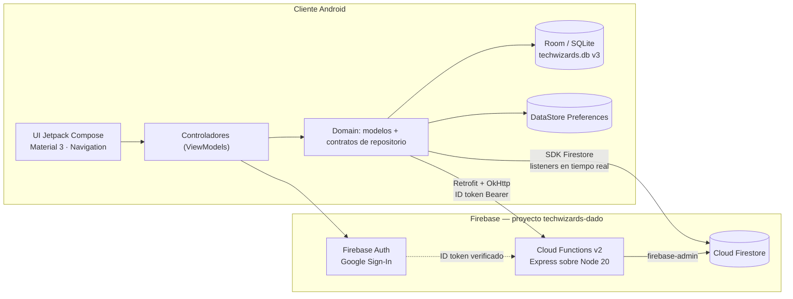
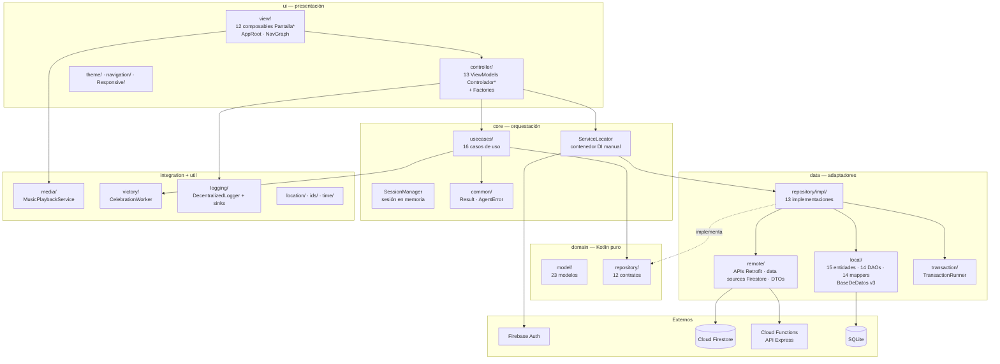
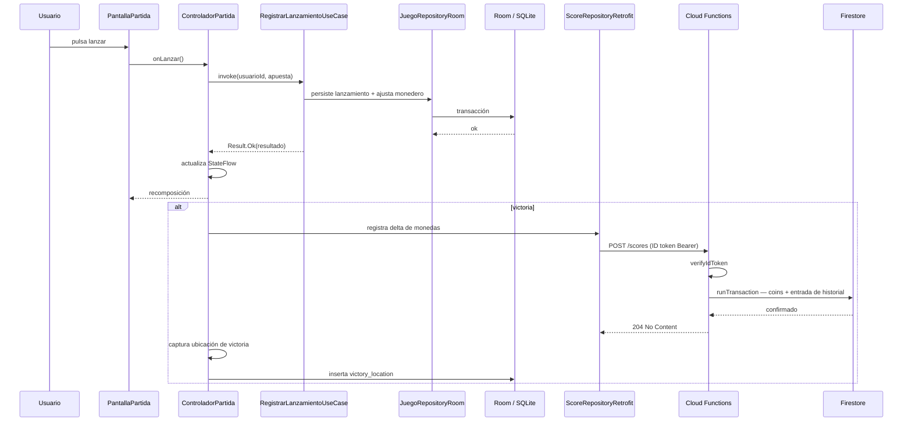
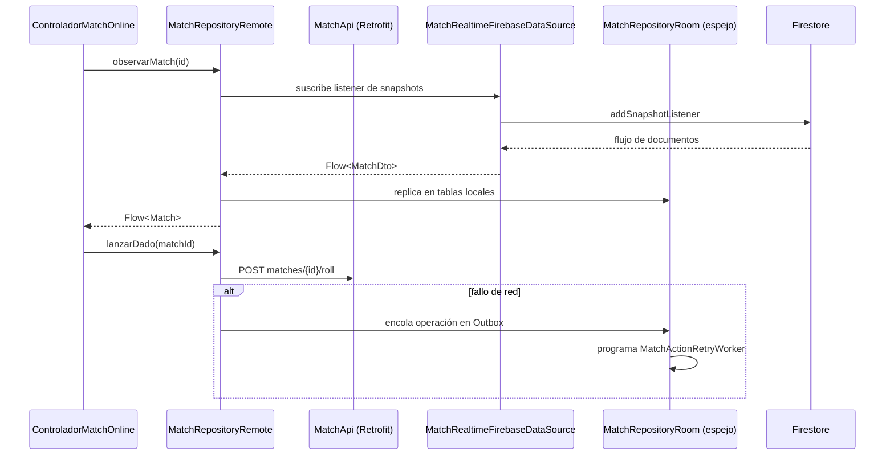
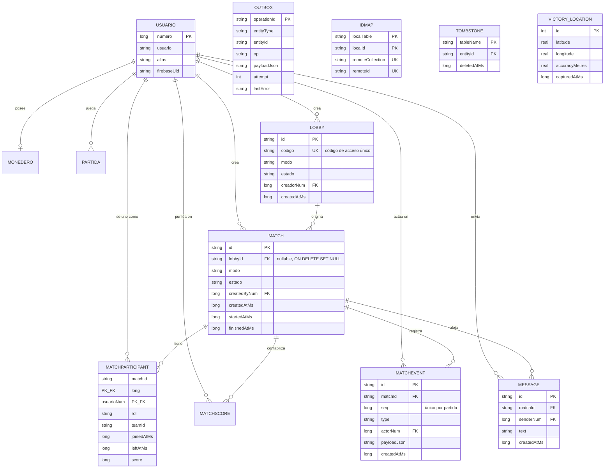
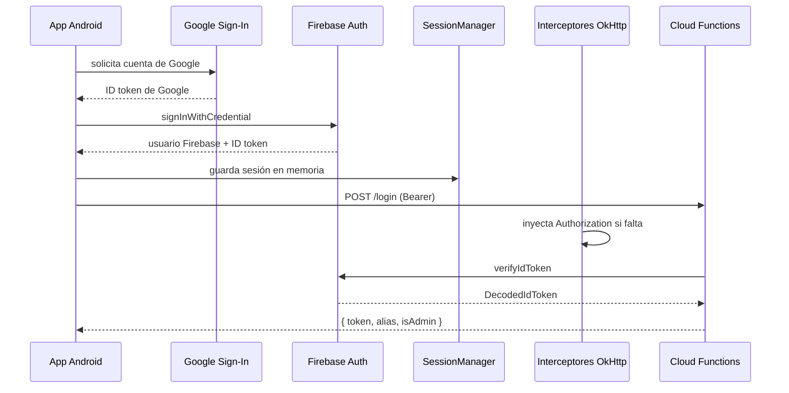
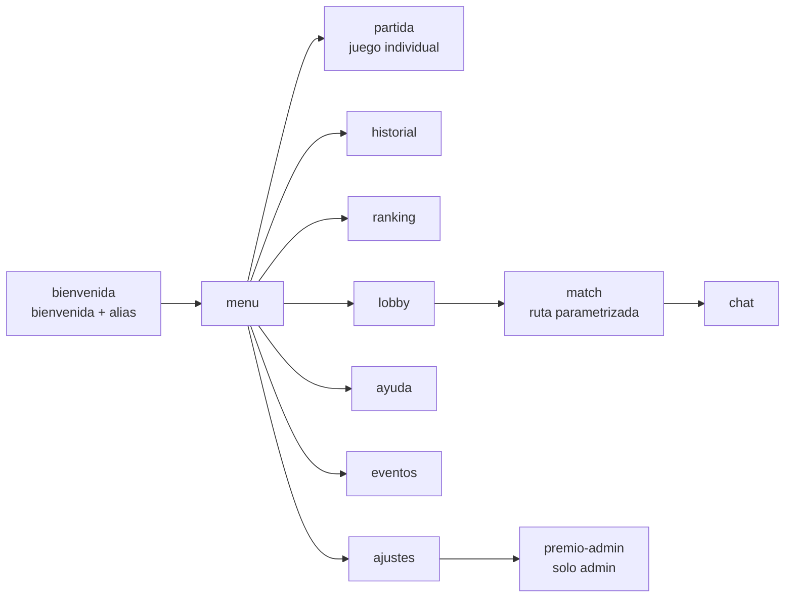
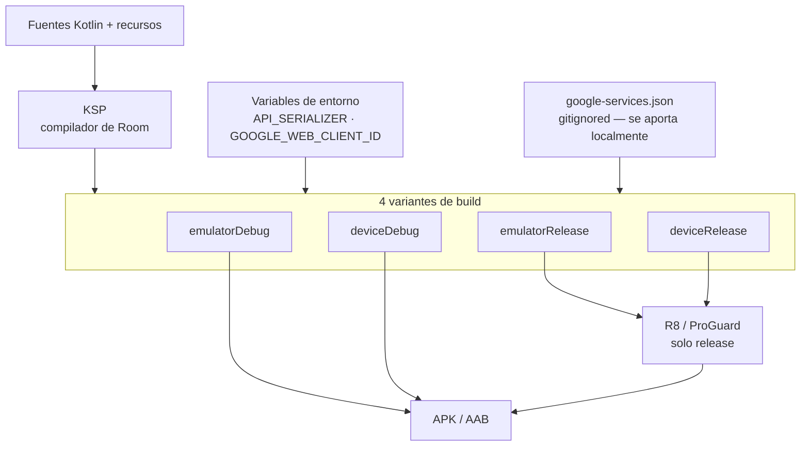

# TechWizards — Especificación de Arquitectura

> **Alcance de este documento.** Toda afirmación técnica que sigue se deriva de artefactos presentes en el repositorio: `libs.versions.toml`, `build.gradle.kts`, `AndroidManifest.xml`, la base de datos Room y sus migraciones, los esquemas exportados, el código TypeScript de Cloud Functions, `firestore.rules`, `.firebaserc` y el árbol de fuentes Kotlin. Cuando el repositorio **no** contiene algo — un pipeline de CI, un `firebase.json`, un motor de sincronización funcional — este documento lo declara explícitamente en lugar de describir un estado deseado.

- **Repositorio:** `https://github.com/dadd86/TechWizards` (rama `master`)
- **Application ID:** `com.diegodiaz.techwizards`
- **Proyecto Firebase:** `techwizards-dado`
- **Versión:** `versionName 1.0` / `versionCode 1`
- **Edición en inglés de este documento:** [`ARCHITECTURE.md`](../../ARCHITECTURE.md)

---

## Índice

1. [Resumen ejecutivo y stack global](#1-resumen-ejecutivo-y-stack-global)
2. [Topología del sistema](#2-topología-del-sistema)
3. [Patrones de diseño y principios](#3-patrones-de-diseño-y-principios)
4. [Modelo de persistencia](#4-modelo-de-persistencia)
5. [Especificación de APIs e interfaces](#5-especificación-de-apis-e-interfaces)
6. [Arquitectura frontend / UI](#6-arquitectura-frontend--ui)
7. [Pipeline de despliegue e infraestructura](#7-pipeline-de-despliegue-e-infraestructura)
8. [Pruebas](#8-pruebas)
9. [Limitaciones conocidas y riesgos arquitectónicos](#9-limitaciones-conocidas-y-riesgos-arquitectónicos)

---

## 1. Resumen ejecutivo y stack global

TechWizards es un **juego de dados multijugador nativo para Android** construido con Jetpack Compose y Kotlin, respaldado por una plataforma serverless de Firebase. La aplicación opera sin conexión: la jugabilidad, el monedero y el estado de las partidas se persisten localmente en Room y se replican hacia una API Express desplegada en Cloud Functions, con Firestore proporcionando flujos en tiempo real de lobby y partida.

### Alcance funcional, derivado del grafo de navegación y los casos de uso

| Área | Capacidades |
| --- | --- |
| **Jugabilidad** | Lanzamientos de dado resueltos por `ResolverTiradaUseCase`, ajuste de saldo del monedero (`Monedero`), detección de victoria |
| **Multijugador** | Lobbies con código de acceso, partidas con participantes, puntuaciones por partida, log de eventos con secuencia monótona, chat en partida |
| **Progresión** | Historial local de partidas, historial remoto replicado en Firestore, ranking top-10 |
| **Premio común** | Bote compartido (`prize/common`) que se acumula mediante incrementos y se cobra de forma atómica e idempotente |
| **Geolocalización** | Coordenadas de victoria capturadas y persistidas localmente (`victory_location`) |
| **Multimedia** | Servicio en primer plano para reproducción de música de fondo |
| **Personalización** | Tres idiomas de interfaz (ES / EN / DE), tema claro/oscuro, color dinámico de Material 3 |
| **Observabilidad** | Logger descentralizado interno con sinks conectables y enmascaramiento de PII |

### Ecosistema de un vistazo



### Tabla tecnológica global

| Capa | Tecnología | Versión |
| --- | --- | --- |
| Lenguaje | Kotlin | `2.0.21` |
| Build | Android Gradle Plugin | `8.13.2` |
| Build | KSP | `2.0.21-1.0.25` |
| Target | `compileSdk` / `targetSdk` / `minSdk` | `36` / `36` / `24` |
| JVM | Java source, target y `jvmTarget` | `17` |
| UI | Jetpack Compose BOM | `2024.10.01` |
| UI | Material 3, Foundation, UI Tooling | vía BOM |
| UI | Activity Compose | `1.11.0` |
| UI | Navigation Compose | `2.9.5` |
| UI | Core SplashScreen | `1.0.1` |
| Ciclo de vida | `lifecycle-runtime-ktx` | `2.9.4` |
| Asincronía | Kotlin Coroutines | `1.10.2` |
| Asincronía | RxJava3 / RxAndroid / coroutines-rx3 | `3.1.8` / `3.0.2` / `1.8.1` |
| Persistencia | Room runtime, ktx, compiler, rxjava3 | `2.6.1` |
| Persistencia | DataStore Preferences | `1.1.1` |
| Segundo plano | WorkManager | `2.9.1` |
| Seguridad | `androidx.security:security-crypto` | `1.1.0` |
| Red | Retrofit | `2.11.0` |
| Red | OkHttp logging interceptor / MockWebServer | `4.12.0` |
| Serialización | Moshi Kotlin | `1.15.1` |
| Serialización | Gson | `2.11.0` |
| Serialización | kotlinx-serialization-json | `1.7.3` |
| Google | Play Services Location | `21.3.0` |
| Google | Play Services Auth | `21.2.0` |
| Firebase | Firebase BOM (Auth KTX, Firestore KTX) | `33.5.1` |
| Firebase | Plugin Google Services | `4.4.2` |
| Backend | Node.js | `20` |
| Backend | TypeScript | `^5.7.3` |
| Backend | Express | `^4.19.2` |
| Backend | firebase-functions / firebase-admin | `^7.0.0` / `^13.6.0` |
| Backend | CORS | `^2.8.5` |
| Pruebas | JUnit 4 / MockK / coroutines-test | `4.13.2` / `1.13.12` / `1.10.2` |
| Pruebas | AndroidX JUnit / Espresso / Compose UI Test | `1.3.0` / `3.7.0` / vía BOM |

### Estructura del repositorio

```text
TechWizards/
├── app/                            # Módulo de aplicación Android
│   ├── src/main/java/com/diegodiaz/techwizards/
│   │   ├── app/                    # Clase Application, MainActivity, gate de idioma
│   │   ├── core/                   # ServiceLocator, SessionManager, Result, casos de uso
│   │   ├── credenciales/           # Abstracción del almacén de credenciales
│   │   ├── data/                   # local (Room), remote (Retrofit/Firestore), repositorios
│   │   ├── domain/                 # Modelos y contratos de repositorio
│   │   ├── integration/            # Reproducción multimedia, celebración de victoria
│   │   ├── ui/                     # Vistas Compose, controladores, navegación, tema
│   │   └── util/                   # Logging, ubicación, ids, tiempo, sync
│   ├── src/test/                   # Pruebas unitarias JVM
│   ├── src/androidTest/            # Pruebas instrumentadas
│   ├── schemas/                    # Esquemas Room exportados (1.json, 2.json, 3.json)
│   └── build.gradle.kts
├── functions/                      # Backend Cloud Functions
│   ├── src/index.ts                # API Express — 9 rutas
│   ├── src/requiereAuth.ts         # (vacío)
│   └── types/                      # Declaraciones de tipos ambientales
├── SQL/PrimerSQL.sql               # Esquema SQL de referencia y pragmas
├── gradle/libs.versions.toml       # Version catalog
├── firestore.rules
├── .firebaserc
└── AGENTS.md                       # Acuerdos de trabajo del proyecto
```

---

## 2. Topología del sistema

### 2.1 Estilo arquitectónico

El módulo Android es un **monolito de módulo único con Clean Architecture**, estratificación estricta a nivel de paquete e **inyección de dependencias manual mediante Service Locator**. No hay framework de DI (Hilt, Koin, Dagger).

El backend es un **monolito HTTP serverless**: una única aplicación Express exportada como un solo punto de entrada de Cloud Functions v2 (`export const api = onRequest({ cors: true }, app)`), configurada con `setGlobalOptions({ maxInstances: 10 })`.

### 2.2 Diagrama de capas



### 2.3 Responsabilidades por capa

| Paquete | Responsabilidad | Depende de |
| --- | --- | --- |
| `domain.model` | Data classes y enums de Kotlin puro | Nada |
| `domain.repository` | 12 contratos de repositorio | `domain.model` |
| `core.common` | Tipo sellado `Result<T, E>`, taxonomía `AgentError` | Nada |
| `core.usecases` | 16 casos de uso, una responsabilidad cada uno | `domain` |
| `core.ServiceLocator` | Grafo singleton perezoso — BD, DAOs, APIs, repositorios, casos de uso | Todo |
| `data.local` | Entidades Room, DAOs, mappers, converters, migraciones | `domain` |
| `data.remote` | Interfaces Retrofit, DTOs, data sources Firestore, mappers | `domain` |
| `data.repository.impl` | 13 repositorios concretos que implementan los contratos de dominio | `data.local`, `data.remote` |
| `ui.controller` | 13 ViewModels que exponen estado inmutable | `core`, `domain` |
| `ui.view` | 12 composables de pantalla más `AppRoot` y `NavGraph` | `ui.controller` |
| `integration` | Servicio de reproducción multimedia, worker de celebración de victoria | `core`, `domain` |
| `util` | Logging, seguimiento de ubicación, proveedor de UUID, formatos de fecha | Nada específico de la app |

La capa de dominio no contiene imports de Android ni de frameworks. Las implementaciones de repositorio dependen de los contratos y no al revés, de modo que la regla de dependencias se respeta — aunque, a diferencia de una configuración multi-módulo, se garantiza por convención y no por la compilación. Véase §9.7.

### 2.4 Flujo de datos — un lanzamiento de dado



### 2.5 Flujo de datos — partida en tiempo real



`MatchRepositoryRemote` se construye en `ServiceLocator` con un parámetro `mirrorRoom` que contiene un `MatchRepositoryRoom` completo. Lo remoto es autoritativo; lo local es un espejo que mantiene la UI reactiva y sobrevive a la pérdida de conectividad.

---

## 3. Patrones de diseño y principios

### 3.1 Patrones identificados en el código

| Patrón | Categoría | Evidencia |
| --- | --- | --- |
| **Service Locator** | Creacional | `object ServiceLocator` con grafo `by lazy` para BD, DAOs, APIs, repositorios y casos de uso |
| **Singleton** | Creacional | `BaseDeDatos.get()` usa double-checked locking con `@Volatile inst` |
| **Factory Method** | Creacional | `ControladorAuthFactory`, `ControladorAjustesFactory`, `ControladorPartidaFactory`, `SimpleVmFactory` implementando `ViewModelProvider.Factory` |
| **Builder** | Creacional | `Room.databaseBuilder(...)`, `OkHttpClient.Builder()`, `Retrofit.Builder()`, `Moshi.Builder()` |
| **Repository** | Estructural | 12 contratos de dominio, 13 implementaciones en `data/repository/impl/` |
| **Adapter** | Estructural | 14 mappers locales más `ScoreRemoteMapper` y `MatchRemoteMapper` traduciendo entidad ⇄ dominio ⇄ DTO |
| **Proxy / espejo** | Estructural | `MatchRepositoryRemote` envolviendo `MatchRepositoryRoom` como `mirrorRoom` |
| **Facade** | Estructural | `ServiceLocator` expone una superficie simplificada sobre todo el grafo de objetos |
| **Cadena de responsabilidad** | Comportamiento | Cadena de interceptores OkHttp: `FirebaseAuthInterceptor` → `SessionAuthInterceptor` → `HttpLoggingInterceptor` |
| **Observer** | Comportamiento | `StateFlow` en controladores, consultas `Flow` de Room, listeners de snapshots de Firestore |
| **Command / Outbox** | Comportamiento | `OutboxEntity` registra `entityType`, `op`, `payloadJson`, `attempt`, `lastError` para reproducción diferida |
| **Strategy** | Comportamiento | Interfaz `LogSink` con implementaciones `AndroidLogSink` y `FileLogSink`, registradas en tiempo de ejecución |
| **Template Method** | Comportamiento | `RoomCallbackPragmas : RoomDatabase.Callback` sobrescribiendo hooks del ciclo de vida |
| **Objeto resultado** | Comportamiento | `sealed class Result<out T, out E>` con `Ok` / `Err`, evitando control de flujo por excepciones |
| **Unit of Work** | Comportamiento | Abstracción `TransactionRunner` / `RoomTransactionRunner` sobre `withTransaction` |
| **Borrado lógico / Tombstone** | Datos | `TombstoneEntity(tableName, entityId, deletedAtMs)` |
| **Identity map** | Datos | `IdMapEntity` mapeando `(localTable, localId)` ⇄ `(remoteCollection, remoteId)` |
| **Clave de idempotencia** | Integración | `claimId` en `POST /prize/common/claim`, comparado con `lastClaimId` dentro de la transacción de Firestore |

### 3.2 Adherencia a SOLID, con evidencia

**Responsabilidad única.** El paquete `core/usecases` contiene 16 clases, cada una exponiendo una operación: `CerrarSesionUseCase`, `RegistrarLanzamientoUseCase`, `ResolverTiradaUseCase`, `ActualizarPremioComunUseCase`, etc. La persistencia, el mapeo y la validación también están separados — 14 entidades, 14 DAOs y 14 mappers dedicados en lugar de un objeto omnipotente.

**Abierto/Cerrado.** El subsistema de logging es el caso más claro. `DecentralizedLogger.registerSink(...)` acepta cualquier `LogSink`; añadir un sink de Crashlytics o de red no requiere tocar el logger:

```kotlin
DecentralizedLogger.registerSink(AndroidLogSink())
DecentralizedLogger.registerSink(FileLogSink(this))
DecentralizedLogger.setMinLevel(LogLevel.INFO)
DecentralizedLogger.addPiiMask(Regex("[0-9a-fA-F-]{6,}"))
```

**Sustitución de Liskov.** Los contratos de repositorio devuelven modelos de dominio y tipos `Result`, nunca entidades de Room ni objetos `Response` de Retrofit, de modo que `MatchRepositoryRoom` y `MatchRepositoryRemote` son intercambiables tras `MatchRepository`.

**Segregación de interfaces.** El acceso remoto se divide en interfaces API estrechas en lugar de un cliente único: `ScoreApi`, `ScoresApi`, `MatchApi`, `PrizeApi`, `FirestorePlayersApi`. Cada una declara solo los endpoints que su consumidor necesita.

**Inversión de dependencias.** Los casos de uso y los controladores dependen de las interfaces de `domain.repository`; los adaptadores concretos se enlazan en `ServiceLocator`. `RetrofitProvider` invierte además la dependencia de autenticación aceptando `tokenProvider: () -> String?` en lugar de importar Firebase, y documenta esa elección en su KDoc.

### 3.3 Convenciones conscientes de seguridad

Los ficheros fuente incluyen bloques KDoc con una etiqueta `@security` explícita que declara la amenaza considerada. Ejemplos encontrados literalmente en el código:

- `Result` — evita exponer excepciones sin sanear a capas superiores.
- `App` — registra el enmascaramiento de identificadores antes de asociar sinks persistentes.
- `SessionAuthInterceptor` — no expone el token en logs y opera únicamente en memoria.
- `BaseDeDatos` — exporta el esquema para auditoría y aplica pragmas; ejecuta migraciones incrementales para evitar pérdida de datos.

`createLoggingInterceptor()` invoca `redactHeader("Authorization")`, de modo que los tokens bearer nunca llegan a Logcat ni siquiera con `Level.BODY`. En el backend, `maskToken()` registra solo la longitud del token y una vista previa de seis caracteres al inicio y al final.

---

## 4. Modelo de persistencia

### 4.1 Estrategia

La persistencia se reparte en tres almacenes, cada uno elegido para un patrón de acceso distinto:

| Almacén | Tecnología | Contenido |
| --- | --- | --- |
| Datos locales estructurados | Room 2.6.1 sobre SQLite, base de datos `techwizards.db`, versión `3` | 15 entidades: usuarios, monedero, partidas, lobbies, matches, chat, contabilidad de sync, ubicaciones de victoria |
| Preferencias clave-valor | DataStore Preferences 1.1.1 | `GameSettings`, etiqueta de idioma seleccionada, caché de snapshot de partida |
| Remoto / compartido | Cloud Firestore | `players/{uid}`, `players/{uid}/history/{id}`, `users/{uid}`, `prize/common` |

Room está configurado con `exportSchema = true` y `room.schemaLocation` apuntando a `app/schemas`, de modo que las versiones 1, 2 y 3 están versionadas como JSON y son diffables en revisión de código. KSP se configura con `room.incremental` y `room.expandProjection` habilitados.

### 4.2 Garantías de integridad

`RoomCallbackPragmas` aplica pragmas de SQLite que fuerzan las claves foráneas y habilitan el journaling WAL. Cada tabla hija declara claves foráneas explícitas con semántica de cascada — por ejemplo `MatchEvent.matchId` y `MatchParticipant.matchId` ambas con `ON DELETE CASCADE`, mientras que `Match.lobbyId` usa `ON DELETE SET NULL` para que una partida sobreviva al borrado del lobby que la originó.

### 4.3 Diagrama entidad-relación



### 4.4 Migraciones

Ambas migraciones están escritas a mano; ninguna usa fallback destructivo, por lo que no se descartan datos de usuario al actualizar.

| Migración | Efecto |
| --- | --- |
| `MIGRATION_1_2` | Añade `Partida.nombreJugador` y lo rellena desde `Usuario.usuario` mediante un `UPDATE` correlacionado; crea `evento`, `Lobby`, `Match`, `MatchEvent`, `MatchParticipant`, `MatchScore`, `Message`, `Outbox`, `IdMap`, `Tombstone`; crea 13 índices, incluidos el único `index_Lobby_codigo` y `index_MatchEvent_matchId_seq` |
| `MIGRATION_2_3` | Elimina la tabla heredada `VictoryLocation` y crea `victory_location` con clave primaria autoincremental |

El relleno de `MIGRATION_1_2` es el detalle destacable: en lugar de dejar la nueva columna con cadena vacía y perder el contexto, recupera el nombre del jugador desde la fila relacionada de `Usuario`.

`MIGRATION_2_3` es un drop-and-recreate, seguro aquí únicamente porque la tabla acababa de introducirse y no contenía datos de producción. Véase §9.9.

### 4.5 Trío de contabilidad de sincronización

Existen tres tablas cuyo único fin es soportar la sincronización con consistencia eventual:

- **`Outbox`** — cola duradera de operaciones remotas pendientes, con contador de intentos y último error, habilitando entrega at-least-once con backoff.
- **`IdMap`** — mapeo de identidad bidireccional para reconciliar IDs generados localmente con los asignados por el servidor. El índice único sobre `(remoteCollection, remoteId)` impide que dos filas locales reclamen la misma entidad remota.
- **`Tombstone`** — marcas de borrado para que una eliminación realizada sin conexión no sea resucitada por una descarga posterior.

Es un diseño offline-first de manual. Las tablas y los DAOs existen y están cableados en `ServiceLocator`; el motor de sincronización genérico que los consume no está implementado. Véase §9.3.

### 4.6 Modelo de datos en Firestore

| Ruta | Escrita por | Contenido |
| --- | --- | --- |
| `users/{uid}` | `POST /login` | `alias`, `updatedAt` |
| `players/{uid}` | `POST /login`, `POST /scores`, cobro de premio | `uid`, `alias`, `coins`, `wins`, `losses`, `updatedAt` |
| `players/{uid}/history/{autoId}` | `POST /scores` | `uid`, `alias`, `deltaMonedas`, `coinsAfter`, `createdAt` server timestamp |
| `prize/common` | endpoints de premio | `descripcion`, `valor`, `lastClaimId`, `lastClaimAmount`, `lastClaimedByUid`, `lastClaimedAt`, `updatedAt`, `updatedByUid` |

### 4.7 Comportamiento transaccional

Las dos operaciones que mutan saldo se ejecutan dentro de `db.runTransaction`, garantizando atomicidad read-modify-write bajo acceso concurrente:

- **`POST /scores`** lee `coins` actual, aplica `Math.max(0, current + delta)` para impedir saldos negativos, escribe el documento del jugador y añade una entrada de historial — todo en una transacción.
- **`POST /prize/common/claim`** lee el bote, comprueba `lastClaimId === claimId` para idempotencia, resetea `valor` a `0`, registra los metadatos del cobro y acredita al jugador. Una petición repetida con el mismo `claimId` devuelve `alreadyClaimed: true` sin pagar dos veces.

El manejador de cobro además repara defensivamente un campo `coins` corrupto: si el valor almacenado no es un número finito se trata como `0` en lugar de producir `NaN`.

---

## 5. Especificación de APIs e interfaces

### 5.1 Superficie del backend — Cloud Functions

Una única app Express exportada como `api`, con `cors({ origin: true })` y `express.json()` aplicados globalmente.

| Método | Ruta | Auth | Comportamiento |
| --- | --- | --- | --- |
| `GET` | `/leaderboard/top10` | Pública | Top 10 de jugadores por `coins`, con posición y cadena de fallback de alias |
| `GET` | `/scores/top10` | Pública | Los mismos datos en la forma compatible con OpenAPI `{ items: [...] }` con timestamps ISO |
| `POST` | `/login` | Bearer | Hace upsert de `users/{uid}` y `players/{uid}`; devuelve `{ token, alias, isAdmin }` |
| `POST` | `/scores` | Bearer | Delta de monedas transaccional más entrada de historial; devuelve `204` |
| `GET` | `/prize/common` | Pública | Premio compartido actual, con valores por defecto si el documento no existe |
| `PUT` | `/prize/common` | Bearer + admin | Fija descripción y valor |
| `POST` | `/prize/common/increment` | Bearer | Suma `delta` al bote de forma transaccional |
| `POST` | `/prize/common/claim` | Bearer | Cobro idempotente; resetea el bote y acredita al llamante |

### 5.2 Autenticación y autorización

**Lado cliente.** Google Sign-In vía Play Services Auth produce una credencial de Firebase; `AuthRepositoryFirebase` la intercambia por una sesión de Firebase. El ID token lo custodian `SessionManager` y `CredentialsStore`, y lo inyectan los interceptores de OkHttp.

**Precedencia de interceptores.** Ambos interceptores de autenticación comprueban primero `request.header("Authorization") != null` y dejan pasar la petición intacta si ya trae cabecera, de modo que una anotación `@Header` explícita en un método Retrofit siempre prevalece sobre la inyección ambiental. Esto evita el clásico bug de cabecera duplicada.

**Lado servidor.** `requireAuth` extrae el token bearer con `/^Bearer (.+)$/` y llama a `admin.auth().verifyIdToken(...)`. Los fallos devuelven `401` con un código legible por máquina (`missing_bearer_token`, `invalid_token`) y nunca filtran la excepción subyacente al cliente.

**Comprobación de administrador.** `requireAdmin` acepta tres formas de claim — `admin === true`, `role === "admin"` o `claims.admin === true` — y devuelve `403 admin_only` en caso contrario.



### 5.3 Validación de entrada

Todo endpoint que muta valida antes de tocar Firestore, con topes explícitos definidos como constantes (`MAX_SCORE = 100_000`, `MAX_PRIZE_VALUE = 100_000`):

| Comprobación | Endpoint | Rechazo |
| --- | --- | --- |
| Alias no vacío tras trim | `/login`, `/scores` | `400 invalid_alias` |
| `Number.isInteger(deltaMonedas)` dentro de `±MAX_SCORE` | `/scores` | `400 invalid_delta` |
| `delta` entero positivo dentro de `MAX_PRIZE_VALUE` | `/prize/common/increment` | `400 invalid_delta` |
| `valor` entero en `[0, MAX_PRIZE_VALUE]` | `PUT /prize/common` | `400 invalid_valor` |
| `claimId` no vacío | `/prize/common/claim` | `400 invalid_claimId` |
| `uid` presente en el token decodificado | todas las rutas autenticadas | `401 missing_uid` |

`Number.isInteger` en lugar de `typeof === "number"` es la elección correcta aquí: rechaza `NaN`, `Infinity` y valores fraccionarios con un único predicado.

### 5.4 Interfaces API del cliente

| Interfaz | Endpoints |
| --- | --- |
| `ScoreApi` | `GET scores/top10`, `GET leaderboard/top10`, `POST scores`, `GET prize/common`, `PUT prize/common`, `POST login`, `POST prize/common/increment`, `POST prize/common/claim` |
| `ScoresApi` | `GET scores/top`, `POST scores` |
| `PrizeApi` | `GET prize/common`, `PUT prize/common` |
| `MatchApi` | `GET matches/{id}`, `GET matches/{id}/participants`, `GET matches/{id}/scores`, `POST matches`, `POST matches/{id}/ready`, `POST matches/{id}/roll` |
| `FirestorePlayersApi` | `GET players/{userId}` contra el endpoint REST de Firestore |

`MatchApi` declara seis endpoints que **no tienen contrapartida en `functions/src/index.ts`**. La orquestación de partidas se sirve, por tanto, mediante listeners en tiempo real de Firestore, no por esa superficie REST. Véase §9.4.

### 5.5 Reglas de seguridad de Firestore

```javascript
rules_version='2'
service cloud.firestore {
  match /databases/{database}/documents {
    match /players/{userId}/history/{historyId} {
      allow read, write: if request.auth != null && request.auth.uid == userId;
    }
    match /{document=**} {
      allow read, write: if request.time < timestamp.date(2026, 1, 16);
    }
  }
}
```

La primera regla es correcta y específica: un jugador solo puede leer y escribir su propia subcolección de historial. La segunda es la regla catch-all temporizada por defecto de la consola de Firebase, y su fecha de expiración ya ha pasado. Véase §9.1 — se trata de un defecto funcional activo, no de una simple carencia de endurecimiento.

### 5.6 Contrato de gestión de errores

Los errores se devuelven como `{ "error": "<código_legible_por_máquina>" }` con el estado apropiado. Códigos observados: `missing_bearer_token`, `invalid_token`, `missing_uid`, `invalid_alias`, `invalid_delta`, `invalid_valor`, `invalid_descripcion`, `invalid_claimId`, `admin_only`, `internal`.

En el cliente, `core.common.AgentError` ofrece una taxonomía equivalente — red, validación, base de datos, timeout, desconocido — y `Result<T, E>` la propaga hacia arriba sin filtrar excepciones.

Una inconsistencia: `/scores` y `/login` devuelven el opaco `internal` ante un fallo, mientras que `/prize/common/increment` y `/prize/common/claim` devuelven `e?.message` y, en el manejador de cobro, el `e?.stack` completo. Véase §9.2.

---

## 6. Arquitectura frontend / UI

### 6.1 Paradigma de renderizado

**Jetpack Compose declarativo con Activity única.** `MainActivity` es la única Activity declarada en el manifiesto. Habilita edge-to-edge, mantiene el estado del tema en `rememberSaveable` y delega en `AppRoot` dentro de `TechWizardsTheme`. La navegación la gestiona Navigation Compose dentro de un único `NavHost`.

### 6.2 Grafo de pantallas

Doce rutas registradas en `NavGraph`, con `bienvenida` como destino inicial:



La duodécima entrada es un `composable(...)` parametrizado con `navArgument` tipado, usado para la pantalla de partida en línea.

### 6.3 Gestión de estado

El estado es unidireccional y de alcance por pantalla. No hay contenedor de estado global, ni store estilo Redux, ni `SharedViewModel` singleton.

| Mecanismo | Propósito |
| --- | --- |
| `StateFlow` en las clases `Controlador*` | Estado de UI, recolectado con `collectAsState()` |
| Clases de estado inmutables (`AuthState`, `AjustesState`) | Contratos tipados de pantalla |
| Implementaciones de `ViewModelProvider.Factory` | Inyección por constructor en ViewModels sin framework de DI |
| `remember` / `rememberSaveable` | Estado local de composición y supervivencia a cambios de configuración |
| Consultas `Flow` de Room | Lecturas locales reactivas |
| DataStore | Preferencias persistidas |
| `SessionManager` | Sesión autenticada en memoria compartida por todo el grafo de objetos |

`ControladorPartida` se instancia deliberadamente una sola vez en `NavGraph` mediante `ControladorPartidaFactory` y se comparte entre los destinos relacionados con el juego, de modo que una partida en curso sobrevive a la navegación.

### 6.4 Tematización

Material 3 con **color dinámico habilitado por defecto** (`dynamicColor: Boolean = true`), con retroceso a paletas explícitas `darkColorScheme` / `lightColorScheme` en niveles de API inferiores a 31. El modo oscuro sigue `isSystemInDarkTheme()` por defecto y puede ser sobrescrito por el usuario, con los recursos `values-night` proporcionando los assets no-Compose correspondientes.

### 6.5 Internacionalización

La selección de idioma por aplicación se implementa con la API de AndroidX en lugar de un apaño casero de locales:

- `android:localeConfig="@xml/locale_config"` declara `en-US`, `de-DE`, `es-ES`.
- `App.aplicarIdiomaPreferido()` lee la etiqueta persistida desde DataStore en `Dispatchers.IO`, la sanea mediante `LocaleListCompat.forLanguageTags` y la aplica con `AppCompatDelegate.setApplicationLocales` en el dispatcher principal.
- `LocaleStartupState.markReady()` bloquea el primer pintado para que la UI nunca se dibuje en el idioma equivocado y luego cambie.
- Conjuntos de recursos: `values` (por defecto), `values-de`, `values-en`, `values-night`.

`sanitizeLanguageTag` recurre al valor por defecto cuando la etiqueta almacenada está vacía o no se puede resolver, de modo que una preferencia corrupta no puede inutilizar el idioma.

### 6.6 Responsividad y arranque

`ui/Responsive/Responsive.kt` expone un objeto `UiDims` que se propaga a través de `NavGraph` hacia las pantallas, centralizando el dimensionado dependiente de breakpoints. El arranque usa `androidx.core:core-splashscreen` con un `Theme.TechWizards.Splash` dedicado.

### 6.7 Segundo plano y multimedia

| Componente | Tipo | Propósito |
| --- | --- | --- |
| `MusicPlaybackService` | Servicio en primer plano, `foregroundServiceType="mediaPlayback"`, `exported=false` | Música de fondo |
| `MusicPlaybackController` | Controlador | Comandos de reproducción desde la UI |
| `VictoryCelebrationWorker` | Worker de `WorkManager` | Celebración diferida de victoria |
| `MatchActionRetryWorker` | Worker de `WorkManager` | Reintenta acciones de partida fallidas desde el outbox |

### 6.8 Permisos declarados

`INTERNET`, `ACCESS_NETWORK_STATE`, `READ_MEDIA_AUDIO`, `POST_NOTIFICATIONS`, `FOREGROUND_SERVICE`, `FOREGROUND_SERVICE_MEDIA_PLAYBACK`, `ACCESS_FINE_LOCATION`, `ACCESS_COARSE_LOCATION`, `WRITE_CALENDAR`, `READ_CALENDAR`, `READ_EXTERNAL_STORAGE` (limitado con `maxSdkVersion="32"`).

El permiso de almacenamiento está correctamente acotado por versión. Los dos permisos de calendario están declarados pero no existe código de calendario en el árbol de fuentes. Véase §9.8.

---

## 7. Pipeline de despliegue e infraestructura

### 7.1 Configuración de build

**Product flavours.** Una dimensión, `target`, con dos flavours que difieren únicamente en `API_BASE_URL`:

| Flavour | `API_BASE_URL` |
| --- | --- |
| `emulator` | `http://10.0.2.2:5002/techwizards-dado/us-central1/api/` |
| `device` | `http://192.168.178.23:5002/techwizards-dado/us-central1/api/` |

`10.0.2.2` es el alias del emulador de Android para el loopback del host; ambos apuntan al emulador de Firebase Functions en el puerto 5002.

**Build types.** `debug` con `isMinifyEnabled = false`; `release` con `isMinifyEnabled = true` y `proguard-android-optimize.txt` más las reglas del proyecto.

**Configuración de build dirigida por entorno.** Dos campos se leen del entorno en tiempo de configuración con valores por defecto seguros:

```kotlin
val apiSerializer = providers.environmentVariable("API_SERIALIZER")
    .orElse("moshi").get()
buildConfigField("String", "API_SERIALIZER", "\"$apiSerializer\"")

val googleWebClientId = providers.environmentVariable("GOOGLE_WEB_CLIENT_ID")
    .orElse("CHANGE_ME").get()
buildConfigField("String", "GOOGLE_WEB_CLIENT_ID", "\"$googleWebClientId\"")
```

Usar `CHANGE_ME` como fallback del cliente OAuth es el instinto correcto: la compilación tiene éxito pero el inicio de sesión falla de forma ruidosa en lugar de usar silenciosamente una credencial versionada.

### 7.2 Matriz de variantes de build



### 7.3 Despliegue del backend

`functions/package.json` define tres scripts:

```json
"build":  "tsc",
"serve":  "npm run build && firebase emulators:start --only functions,firestore",
"deploy": "firebase deploy --only functions"
```

El runtime está fijado a Node 20. La concurrencia se acota con `setGlobalOptions({ maxInstances: 10 })`, limitando tanto el fan-out de arranques en frío como el coste.

`.firebaserc` vincula el proyecto por defecto a `techwizards-dado`. **No existe un `firebase.json` en el repositorio**, de modo que tanto `serve` como `deploy` fallarán en una clonación limpia. Véase §9.5.

### 7.4 Configuración de seguridad de red

`android:usesCleartextTraffic="true"` está fijado a nivel de aplicación, y `network_security_config.xml` permite tráfico en claro para exactamente tres hosts:

```xml
<domain-config cleartextTrafficPermitted="true">
    <domain includeSubdomains="false">10.0.2.2</domain>
    <domain includeSubdomains="false">127.0.0.1</domain>
    <domain includeSubdomains="false">192.168.178.23</domain>
</domain-config>
```

La lista blanca por dominio es el mecanismo correcto. Sin embargo, el `usesCleartextTraffic="true"` a nivel de aplicación anula la restricción y permite tráfico en claro en cualquier destino. Véase §9.6.

### 7.5 Gestión de secretos

| Secreto | Tratamiento |
| --- | --- |
| `google-services.json` | Gitignored bajo cuatro patrones; nunca versionado |
| `GOOGLE_WEB_CLIENT_ID` | Variable de entorno con fallback `CHANGE_ME` |
| ID token de Firebase | Solo en memoria, vía `SessionManager` y `CredentialsStore` |
| `local.properties` | Gitignored |

`.gitignore` aplica además una exclusión global `*.json` con reinclusiones puntuales (`!functions/tsconfig.json`, `!functions/package.json`), lo que constituye una postura defensiva frente a la subida accidental de ficheros de credenciales.

### 7.6 Integración y entrega continuas

**No existe pipeline de CI/CD en este repositorio.** No hay directorio `.github/workflows/` ni configuración de GitLab CI. Compilación, pruebas, linting y despliegue son todos manuales.

---

## 8. Pruebas

| Source set | Fichero | Tests |
| --- | --- | --- |
| `test` | `ControladorAuthTest.kt` | 3 |
| `test` | `RegistrarUbicacionVictoriaUseCaseTest.kt` | 2 |
| `test` | `scoresRepositoryRemoteTest.kt` | 2 |
| `test` | `decentralizedLoggerTest.kt` | 2 |
| `test` | `AuthRepositoryFirebaseTest.kt` | 1 |
| `test` | `ExampleUnitTest.kt` | 1 (plantilla por defecto de Android) |
| `test` | `VictoryLocationLocalMapperTest.kt` | 0 |
| `androidTest` | `ExampleInstrumentedTest.kt` | 1 (plantilla por defecto de Android) |

**Total: 12 métodos `@Test`**, de los cuales 2 son tests de plantilla de Android Studio sin modificar y 1 clase no declara ningún test. El recuento efectivo de pruebas con propósito es de **9**.

La infraestructura de pruebas está, no obstante, bien provista: MockK `1.13.12`, `kotlinx-coroutines-test`, OkHttp MockWebServer para tests a nivel de API, Espresso y Compose UI Test con `ui-test-manifest` en la variante de depuración. `ScoresRepositoryRemoteTest` usa MockWebServer para ejercitar la capa Retrofit contra un stub HTTP real, que es la técnica adecuada.

Para un código de 203 ficheros Kotlin de producción con 16 casos de uso y 13 repositorios, 9 pruebas significativas es poco. La arquitectura es altamente testeable — toda dependencia es una interfaz enlazada en `ServiceLocator` — de modo que la carencia es de inversión, no de diseño. Véase §9.10.

---

## 9. Limitaciones conocidas y riesgos arquitectónicos

Los hallazgos se declaran con claridad, ordenados por severidad. Una especificación que los omitiera no describiría el sistema con precisión.

### 9.1 La regla catch-all de Firestore ha expirado — defecto funcional activo

```javascript
match /{document=**} {
  allow read, write: if request.time < timestamp.date(2026, 1, 16);
}
```

Es la regla temporizada por defecto de la consola de Firebase y su expiración ya ha pasado. Toda ruta de cliente distinta de `players/{userId}/history/{historyId}` está ahora **denegada** para acceso directo desde el SDK. Los listeners en tiempo real de lobby y partida que leen `players/{uid}` o documentos de partida directamente fallarán con errores de permisos.

Las rutas del lado servidor no se ven afectadas, porque `firebase-admin` omite las reglas de seguridad — que es precisamente por lo que el fallo es asimétrico y fácil de diagnosticar mal: el endpoint del ranking sigue funcionando mientras los listeners en tiempo real no.

**Remediación:** sustituir el catch-all por reglas explícitas por colección. Como mínimo: `players/{uid}` legible por cualquier usuario autenticado y escribible solo a través del backend; `prize/common` legible por usuarios autenticados, escribible solo con claims de administrador; `users/{uid}` restringido al propietario.

### 9.2 Trazas de pila devueltas a los clientes

`POST /prize/common/claim` devuelve el mensaje de excepción en bruto y la pila completa ante un fallo:

```typescript
return res.status(500).json({
  error: e?.message ?? String(e),
  stack: e?.stack ?? null,
});
```

`POST /prize/common/increment` devuelve de forma similar `e?.message`. Esto filtra rutas internas, versiones de dependencias y estructura del código a cualquier llamante. Los demás manejadores devuelven el opaco `internal` y registran el detalle en el servidor, que es el patrón correcto; estos dos deberían alinearse.

### 9.3 El motor de sincronización no está implementado

Las tablas `Outbox`, `IdMap` y `Tombstone` existen con DAOs, mappers y modelos de dominio. Pero:

- `util/sync/SyncWorker.kt` es un cuerpo de clase vacío: `class SyncWorker { }`.
- `SyncRepositoryRoom.sincronizarDatosRx()` devuelve un `Completable` cuya acción es un bloque vacío, con un comentario que declara que la lógica es un placeholder.

Las mutaciones sin conexión quedan por tanto registradas pero nunca las reproduce un worker de sincronización genérico. `MatchActionRetryWorker` cubre específicamente las acciones de partida, de modo que la carencia es el motor genérico y no todo el comportamiento de reintento.

### 9.4 `MatchApi` no tiene implementación en servidor

`MatchApi` declara seis endpoints REST — `GET matches/{id}`, `GET matches/{id}/participants`, `GET matches/{id}/scores`, `POST matches`, `POST matches/{id}/ready`, `POST matches/{id}/roll` — ninguno de los cuales aparece en `functions/src/index.ts`. Cualquier llamada que los alcance recibe un `404` de Express. El estado de partida fluye en su lugar a través de listeners de Firestore. O se implementan las rutas o se elimina la interfaz para que el contrato no induzca a error.

### 9.5 Falta `firebase.json`

`.firebaserc` está versionado pero `firebase.json` no. Sin él, `firebase emulators:start` y `firebase deploy` fallan ambos, de modo que ni el script `serve` ni el `deploy` de `functions/package.json` funcionan en una clonación limpia. El fichero contiene además la configuración de puertos del emulador de la que depende el `:5002` codificado del flavour `emulator`.

### 9.6 `usesCleartextTraffic="true"` a nivel de aplicación

La lista blanca por dominio de `network_security_config` está bien construida, pero `android:usesCleartextTraffic="true"` en la etiqueta `<application>` la anula y permite HTTP en claro hacia cualquier host. Eliminar el atributo a nivel de aplicación deja vigente la lista blanca de tres hosts, que es el comportamiento pretendido. Debe resolverse antes de cualquier build de release.

### 9.7 `EncryptedCredentialsStore` no realiza cifrado alguno

El nombre de la clase promete cifrado; la implementación son dos campos de cadena `@Volatile` en memoria, y su propio KDoc lo dice: *"Implementación mínima en memoria… No persiste valores en disco."*

Mantener un ID token de vida corta solo en memoria es una decisión de seguridad defendible — posiblemente más segura que persistirlo. El problema es que el nombre afirma lo contrario de lo que hace el código, que es exactamente el modo en que un futuro lector acaba asumiendo una garantía que no existe. `androidx.security:security-crypto 1.1.0` está declarado como dependencia y no se usa. O se renombra a `InMemoryCredentialsStore` o se implementa almacenamiento respaldado por `EncryptedSharedPreferences`.

### 9.8 Permisos no utilizados y dirección LAN codificada

`WRITE_CALENDAR` y `READ_CALENDAR` se solicitan pero no existe integración de calendario en el árbol de fuentes. Los permisos sin uso reducen la conversión de instalación y provocan preguntas en la revisión de Play Console; deberían eliminarse hasta que la funcionalidad exista.

El flavour `device` y la configuración de seguridad de red codifican ambos `192.168.178.23`, una dirección LAN privada de un desarrollador. Debería provenir de una propiedad de Gradle o de una variable de entorno.

### 9.9 Reproducibilidad del build y duplicación de dependencias

- **`gradle.properties` fija una ruta de JDK de Windows:** `org.gradle.java.home=C:\\Program Files\\Android\\Android Studio\\jbr`. Esto rompe la compilación en macOS, Linux y en cualquier runner de CI. Pertenece a un `local.properties` gitignored o debería eliminarse en favor de una declaración de toolchain.
- **Retrofit está declarado dos veces:** `libs.retrofit` y `libs.retrofit.core` resuelven al mismo módulo, `com.squareup.retrofit2:retrofit`. El propio fichero de build incluye un comentario reconociendo el riesgo.
- **Se empaquetan dos stacks JSON:** los converters de Moshi y de Gson más `kotlinx-serialization-json`. Solo Moshi está cableado en `RetrofitProvider`. Esto infla el APK y el recuento de métodos sin beneficio alguno.
- **`composeOptions.kotlinCompilerExtensionVersion = "1.7.3"`** es redundante junto al plugin del Compose Compiler de Kotlin 2.0, que gestiona la versión por sí mismo.
- **`org.gradle.parallel=false`** y `kotlin.compiler.execution.strategy=in-process` están fijados, ralentizando materialmente las compilaciones. Parecen soluciones temporales a un problema local puntual.
- **`DataError.kt` duplicado** existe tanto en `data/result/` como en `data/transaction/`.
- **`ui/Responsive/`** está capitalizado mientras su declaración de paquete es `ui.responsive`, una inconsistencia que causa problemas en sistemas de ficheros sensibles a mayúsculas.

### 9.10 Paradigmas de asincronía mezclados

El código ejecuta Coroutines/`Flow`, `Completable`/`Single` de RxJava3, y establece puentes entre ambos mediante `kotlinx-coroutines-rx3` y `kotlinx-coroutines-reactive`. `SyncRepositoryRoom` expone `sincronizarDatosRx()` y luego lo envuelve con `.await()` en `sincronizarDatos()`.

Dos modelos de concurrencia en un mismo código duplican la superficie de gestión de errores, la semántica de cancelación que un mantenedor debe tener en mente, y el peso de dependencias. Consolidar en Coroutines eliminaría tres dependencias y simplificaría la capa de repositorios.

### 9.11 Inyección de dependencias manual a escala

`ServiceLocator` es un único `object` que cablea el grafo completo — Firebase, base de datos, DAOs, transaction runners, almacén de credenciales, cuatro instancias de Retrofit, data sources de Firestore, mappers, repositorios y casos de uso. Funciona, y la inicialización perezosa es correcta, pero es un singleton global mutable que exige `init(context)` antes de cualquier acceso, y dificulta la sustitución por test. Un framework de DI, o dividir el locator en módulos por funcionalidad, mejoraría la testabilidad. `data/infra/di/moduloPartidas.kt` sugiere que esa modularización se llegó a iniciar.

### 9.12 Preparación para release

`versionCode = 1` y `versionName = "1.0"` no se han incrementado. `isMinifyEnabled = true` está fijado en release pero no hay cobertura de pruebas que ejercite un build procesado por R8, y Moshi basado en reflexión (`KotlinJsonAdapterFactory`) es precisamente el tipo de dependencia que se rompe bajo shrinking agresivo sin reglas keep explícitas.

---

## Apéndice A — Inventario de módulos

| Categoría | Cantidad |
| --- | --- |
| Ficheros Kotlin de producción | 203 |
| Modelos de dominio | 23 |
| Contratos de repositorio de dominio | 12 |
| Implementaciones de repositorio | 13 |
| Casos de uso | 16 |
| Entidades Room | 15 |
| DAOs de Room | 14 |
| Mappers locales | 14 |
| Migraciones de Room | 2 (v1→v2, v2→v3) |
| Esquemas exportados | 3 |
| Pantallas Compose (`Pantalla*`) | 12 |
| Rutas de navegación | 12 |
| Controladores (ViewModels) | 13 |
| Interfaces API de Retrofit | 5 |
| Rutas de Cloud Functions | 9 |
| Workers de WorkManager | 2 |
| Servicios en primer plano | 1 |
| Locales soportados | 3 (es-ES, en-US, de-DE) |
| Variantes de build | 4 |
| Métodos de test | 12 (9 con propósito) |

## Apéndice B — Variables de entorno

| Variable | Consumidor | Valor por defecto | Propósito |
| --- | --- | --- | --- |
| `API_SERIALIZER` | `app/build.gradle.kts` | `moshi` | Selecciona el converter de Retrofit |
| `GOOGLE_WEB_CLIENT_ID` | `app/build.gradle.kts` | `CHANGE_ME` | ID de cliente web OAuth para Google Sign-In |

`API_BASE_URL` no es una variable de entorno; es un `buildConfigField` por flavour. Véase §9.8 para la dirección LAN codificada que incrusta.
